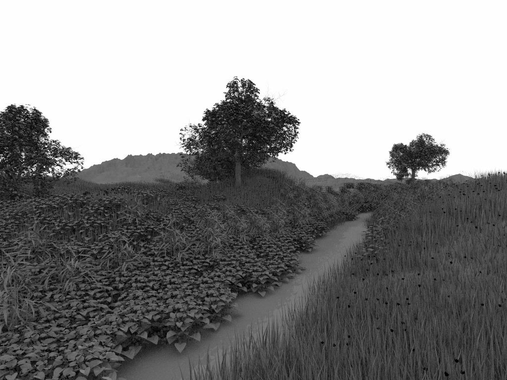
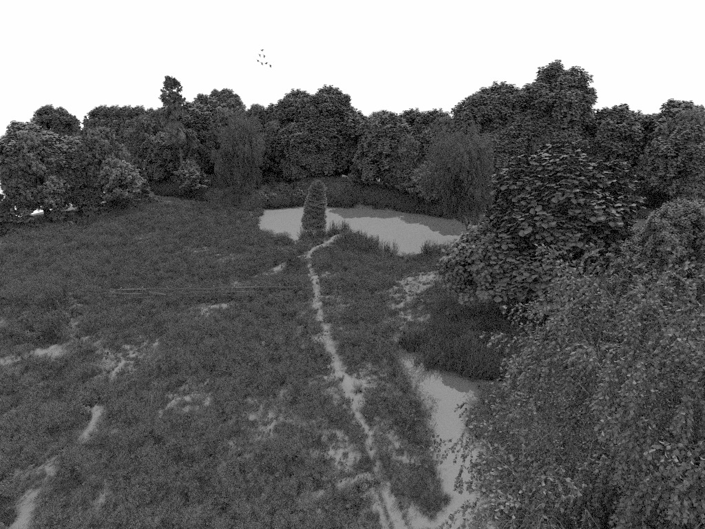

PBRT-Parser (V1.1)
==================

The goal of this project is to provide a free (apache-lincensed) open
source tool to easily (and quickly) load PBRT files (such as PBRT's
own "pbrt-v3-scenes" test scenes, or Disney's Moana island model).

In particular it

- contains both a purely syntatical as well as a more advanced
  semantical parser (see below)

- can parse the original (ie, ascii-) '.pbrt' files from pretty much
  any pbrt file I could find.

- comes with support for reading and writing the resulting pbrt scene
  graph to a binary ".pbf" format (.pbf = binary pbrt format) that is
  *significantly* faster to read.  I.e., you can use the included
  pbrt2pbf to convert to convert a ascii .pbrt file to a binary .pbf
  file, which when loaded by an application will yield exactly the
  same scene graph as parsing the original .pbrt file, just much
  faster (for moana, that drops parsing time from 30ish minutes to
  seconds!).

A few screenshots:

# Contributors (in "order of appearance")

- Ingo Wald
- Fabio Pellacini (University of Rome)
- Stefan Zellman (University of Cologne)
- lots of other people, through suggestions, bug reports, etc ...

# Release Notes

V 2.2:

- have first area light sources (distant and infinite)
- added reverseorientation
- added InfiniteLight::{nsamples,L,scale}

V 2.1.4: Various bugfixes:

- textures now have 'name' field, which now gets read and written to/from binary
- fixed core dump when reading/writing spectrum values in pbfs.
- bumped binary file format to v1.0 (due to changes in format)

V 2.1:

- added semantic parsing of 'AreaLights', which are now attached to
  shapes, and stored to/loaded from PBF files.

- significant cleanup of semantic parser: SemanticParser is now a
  separate class in a sepa rate header file, with all texture-,
  mateiral-, geometry-, etc based parsing in separate implementation
  files. Also, the single giant "parseMaterial" etc have been split
  into type-specific parse functions (eg, parseMaterial_disney vs
  parsematieral_mix, etc), further increasing readability.

V 2.0:

- amalgamated all *public* API into a single header file
  (include/pbrtParser/Scene.h) that now only contains the fully
  semantically parsed Scene. All intermediary syntax-only parsing is
  now hidden in the impl/ directory, is no longer installed, and is no
  longer exported as a separate library. From now on, only a single
  library with a single header files is required after install.

# Status

The *semantical* parser currently supports:

- Shapes: `trianglemesh`, `disk`, `sphere`, and 'curve' are supported.
- Materials: `Disney`, `Uber`, `Mix`, `Metal`, `Mirror`, `Matte`, `Translucent`, `Plastic`, `Substrate`, `Fourier`, and `Glass` should all work. In particular, all indirect references (e.g., a "mix" material referencing two other materials by name) are now properly resolved.
- Textures: `Image`, `PtexFile` (storing only the filename, not the ptx data), `Fbm`, `Windy`, `Marble`, `Scale`, `Wrinkled`, `Mix`, and `Constant`. As with materials, all indirect references should be fully recognized.
- File formats
  - `.pbrt` : the original pbrt file format - slow to parse, but will work
  - `.pbf`  : our own binary file format (use `pbrt2pbf` to convert ascii pbrt to binary pbf)

Disclaimer(s): I did do a significant amonut of testing to make sure that the
parser can load all .pbrt files without complaining, and that the above classes will
parse everything that's in those files .... BUT:

- I may have missed some things - please let me know...

- The parser _should_ parse all .pbrt files I could find, but there
  will likely be other files that are valid PBRT files that the parser
  would choke. If you find any, please let me know.

- I do not currently have a fully PBRT compliant renderer, so cannot
  test whether all the parsed data is actualy parsed
  correctly. Generally triangle meshes, objects, instances,
  transforms, material and texture types, mapping of
  materials/textures etc to shapes, etc, should all work, but I can't
  entirely vouch for all material properties or texture properties of
  all material types.

- I *will* parse auxiliary .ply files as part of the parsing process,
  but will *not* parse texture formats, ptex, spectrum specs, etc. For
  all such auxiliary files I'll include the file name, but leave it to
  the app to load such files (else I'd require tons of external
  dependencies)

## Known Limitations

- `loopsubdiv` shapes are still ignored.

- `curve` is currently a single shape type; would make senes to split
  into FlatCurve, CylinderCurve, etc.

- some models use camera space for object definitions - this isn't supported yet.

# A Brief History of this Project

This project started out as being mostly a toy project for my own use,
_originally_ with the sole goal of being able to load PBRT's heavily
instanced models (ecosys, landcape, and sanmiguel) for some ray
tracing/instancing research.

Since then, it's come a long way, and has pretty much become my method
of choice for getting content into my various ray tracing projects:
First, with more powerful hardware around it's now more practical to
have good material data around for one's ray tracing research, and
other than PBRT's models there's previous few freely available models
with anything other than OBJ Wavefront's material model. Second, last
year Disney released the Moana island in two file formats, one of
which is PBRT - and since my original "toy project" already did _most_
of what was required to load Moana I ended up spending some more time
on this, and bringing it to a state where I can use it for pretty much
any PBRT model (including Moana, of course).

For those that have looked at this library in its early stages: it has
changed a lot! In its original form, it was a purely syntactical
parser that did parse the transforms and object hierarchy, as well as
external ply files for triangle meshes, but wouldn't go much beyond
that. Anytying else - materials, textures, lights, and even most
Shape-related stuff - wasn't parsed beyond pure "name:value" pairs
that you'd then have to parse interpret yourself to figure out, for
example, what exact kind of material it was, what it's name-value
pairs meant in actual material parameters, etc.

Since then, after having had to realize myself that that wasn't enough
I eventually went ahead and significantly extended this library to
have _both_ a purely syntactical _and_ a more advanced semantical
parser that would also parse materials, textures, shapes, etc (see
below), and eventually also added a binary file format to deal with,
in particular, the egregious load times for the 40+GB Moana model (in
binary format this now takes only seconds rather than half an
hour...).

At its current stage, the library _should_ be able to parse pretty
much anything I could find in pbrt file format. If you find something
it doesn't parse at all, let me know. That said, since I don't have a
fully PBRT compliant renderer yet there will, by necessity, be several
things that I haven't tested at all. If you do find something that's
obviously broken, let me know (and I'll gladly take pull requests,
too!).

Semantical vs Syntactical Parser
================================

When looking at parsers, they typically consist of two intermingled
stages: pure syntax (e.g., regnozizing the word "Shape" as the
beginning of a shape definition) to full semantic (e.g., what a shape
actually is, and how it behaves). For many formats, the boundary
between those two extremes is "a bit" wishy-washy, with much of the
semantics requiring way more effort to understand than the pure
syntax. Arguably the most extreme format on that spectrum is XML,
where the syntax itself only defines "nodes", "attributes", and
"content", with *all* semantical meaning of what specific nodes or
attributes actually mean left for the app to figure out.

PBRT specifies _some_ more semantics in the format (e.g., the file
format itself specifies that a Shape is different from a Material),
but still leaves a lot to be figured out afterwards. For example, in
terms of pure syntax a triangle mesh and a sphere are both "shapes"
that just differ in what parameters got attached to that shape. That
makes the format easy to extend (you could add a new geometry type of
material type to PBRT without changing the file format at all!), but
leaves more work for the app to figure our what certain name:value
pairs actually meant.

Initially, this project only focussed on the syntax, and left all
interpretation of name:value pairs to the application. This however
can be rather tricky, and after I wrote that "name:value
interpretation code" multiple times in multiple project I eventually
decided to put that into this library as well, resulting in both a
purely syntactical, as well as a more ready-to-use semantical parser.

To explain the difference: In the *syntactical* parser, for a given
triangle mesh you'd end with a C++ class of type "Shape" that would
have a parameter "name" with type "string", a size of 1, and a value
of [ "trianglemesh" ], as well as a pamameter "P" with type "float", a
size of 3*N, and a value of [ x0 y0 z0 x1 .... zN ] .... but it'd have
to be the application that has to figure out that this is a triangle
mesh with a vertex array. In the *semantical* parser (which of course
builds on top of the syntactical parser as an intermediary parsing
step) you will instead end up with a class "TriangleMesh" that has a
C++ class member of "std::vector<vec3f> position", etc. Similarly for
materials: The syntactical parser only tells you that there _is_ a
material with a string specifying, for example, the type "disney", and
a list of parameters; while the semantical parser would parse this
down to a C++ "DisneyMaterial" class, with C++ members for the
material parameters, etc.

LICENSE
=======

This project comes with Apache 2.0 license - pretty much "use as you see fit".

USAGE
=====

For examples usages, see the simply tools (e.g., pbrtInfo or pbfInfo)
in the apps directory.

Suggested use is with CMake, in which form you can use it in either
one of two ways:

Option 1: Make Install
----------------------

Build the project with cmake, and "make install" to a
install directory. Once installed (say, to /usr/local)
- In your source code, `include "pbrtParser/semantic/Scene.h"`
- In your project, link to the `pbrtParser_semantic` library.

Of course, this way you can use whatever build system you want to use.

Option 2: Cmake with source-access
----------------------------------

If you don't like the "make install" option, you can also include the
full source three, either as a complete copy of this project (ugh), or
(preferred!) as a git submodule.

Assuming you're building your main project with cmake, and assuming this parser
is included in <project>/external/pbrtParser (hint: `git submodule add https://github.com/ingowald/pbrtParser.git external/pbrtParser` ... just saying....):

- in your CMakeLists.txt:

   add_subdirectory(external/pbrtParser EXCLUDE_FROM_ALL)
   include_directories(${CMAKE_PROJECT_SOURCE_DIR}/external/pbrtParser)
   ...
   target_link_libraries(<myProjects> pbrtParser_semantic)

- in your source file:

   #include "pbrtParser/semantic/Scene.h"
   ...
   pbrt::semantic::Scene::SP scene = pbrt::semantic::Scene::loadFrom(fileName);
   ...

Optional: Use your own vector library
-------------------------------------

One of the most common issues with using other peoples' C++ libraries
in graphics is that - of course! - everybody wants to use their own
favorite libraries for math and vector operations.

This project internally uses a somewhat older copy of the "ospcommon"
library that comes with the ospray project; however, to avoid some of
the otherwise common naming clashes all of this is hidden within the
actual parser and lexer implementation, and the publicly visible
interface in semantic/Scene.h uses simple, plain-C structs that only
specify the data _layout_ of the vec3f, vec4i, etc classes.

As such, if you want to use your own vector classes, there are two
ways of doing this:

- Option 1: Add a default constructor to your own vector classes that
  will be able to construct your own types from these plain-C classes.

- Option 2: Assuming your own vector calsses *do* have the same data layout
  as the ones that the parser expects, you can also do a

   #define PBRT_PARSER_PARSER_VECTYPE_NAMESPACE myown::math
   #include <pbrtParser/semantic/Scene.h>
   
  ... which will make your own code "think" that the parser was
  actually using your own vector library. This is, of course, a bit
  hacky, so use at your own risk.
